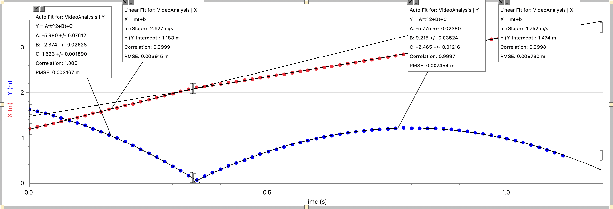
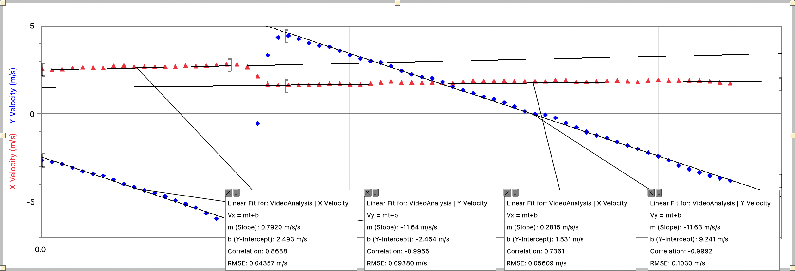

# Two-Dimensional Motion Project for Accelerated Physics

## Video

I decided to record a video of myself throwing a tennis ball downwards first, proceeding downwards more from gravity, and allowing it to hit the ground and bounce up again. I thought it would be interesting to analyse how the velocity might change from the bounce.

<video controls style="max-width: 100%;">
  <source src="./ball.mp4" type="video/mp4">
</video>

To determine the correct scaling, I placed a racket on the ground, which I knew was $0.68\,\mathrm m$ long.

## Questions

Perhaps my most important driving question here was:

> How did the motion of the ball change after the bounce?

Additionally, because my data was imperfect, I also wanted to answer this:

> How and why was my data imperfect? What possible factors were there?

We could also speculate on whether there was acceleration other than from gravity, for example.

## Data

Here is the data I got, after I plotted the positions on Logger Pro:

| Time $t$ ($\mathrm s$) | Horizontal position $x$ ($\mathrm m$) | Vertical position $y$ ($\mathrm m$) | Horizontal velocity $v_x$ ($\mathrm m/\mathrm s$) | Vertical velocity $v_y$ ($\mathrm m/\mathrm s$) |
| -: | -: | -: | -: | -: |
| $1.0000$ | $1.1903$ | $1.6260$ | $1.5081$ | $-2.6290$ |
| $1.0167$ | $1.2334$ | $1.5830$ | $1.4454$ | $-2.7139$ |
| $1.0333$ | $1.2704$ | $1.5374$ | $1.4716$ | $-2.8453$ |
| $1.0500$ | $1.3147$ | $1.4899$ | $1.5482$ | $-3.0644$ |
| $1.0667$ | $1.3563$ | $1.4347$ | $1.5744$ | $-3.2602$ |
| $1.0833$ | $1.4015$ | $1.3801$ | $1.5581$ | $-3.4015$ |
| $1.1000$ | $1.4414$ | $1.3206$ | $1.5425$ | $-3.5068$ |
| $1.1167$ | $1.4830$ | $1.2653$ | $1.6877$ | $-3.7193$ |
| $1.1333$ | $1.5340$ | $1.1976$ | $1.6819$ | $-3.9871$ |
| $1.1500$ | $1.5736$ | $1.1305$ | $1.6135$ | $-4.1622$ |
| $1.1667$ | $1.6193$ | $1.0589$ | $1.6223$ | $-4.3361$ |
| $1.1833$ | $1.6614$ | $1.9858$ | $1.6170$ | $-4.4976$ |
| $1.2000$ | $1.7068$ | $1.9094$ | $1.6128$ | $-4.6821$ |
| $1.2167$ | $1.7480$ | $1.8305$ | $1.6300$ | $-4.9066$ |
| $1.2333$ | $1.7940$ | $1.7451$ | $1.6723$ | $-5.1097$ |
| $1.2500$ | $1.8384$ | $1.6601$ | $1.6514$ | $-5.3195$ |
| $1.2667$ | $1.8814$ | $1.5701$ | $1.6859$ | $-5.6367$ |
| $1.2833$ | $1.9277$ | $1.4721$ | $1.7287$ | $-5.9436$ |
| $1.3000$ | $1.9725$ | $1.3687$ | $1.7694$ | $-6.0675$ |
| $1.3167$ | $1.0204$ | $1.2699$ | $1.7428$ | $-5.8455$ |
| $1.3333$ | $1.0653$ | $1.1621$ | $1.5929$ | $-4.6064$ |
| $1.3500$ | $1.1137$ | $1.0634$ | $1.0836$ | $-0.5291$ |
| $1.3667$ | $1.1338$ | $1.1482$ | $1.6270$ | $1.3435$ |
| $1.3833$ | $1.1602$ | $1.2278$ | $1.5830$ | $1.3449$ |
| $1.4000$ | $1.1868$ | $1.3024$ | $1.5737$ | $1.4367$ |
| $1.4167$ | $1.2133$ | $1.3751$ | $1.5675$ | $1.2571$ |
| $1.4333$ | $1.2387$ | $1.4457$ | $1.5728$ | $1.0245$ |
| $1.4500$ | $1.2649$ | $1.5076$ | $1.6214$ | $1.8760$ |
| $1.4667$ | $1.2933$ | $1.5735$ | $1.6406$ | $1.7966$ |
| $1.4833$ | $1.3198$ | $1.6368$ | $1.6463$ | $1.5846$ |
| $1.5000$ | $1.3488$ | $1.6935$ | $1.6153$ | $1.3406$ |
| $1.5167$ | $1.3732$ | $1.7474$ | $1.6150$ | $1.1337$ |
| $1.5333$ | $1.4022$ | $1.7968$ | $1.6439$ | $1.9933$ |
| $1.5500$ | $1.4270$ | $1.8459$ | $1.7207$ | $1.9187$ |
| $1.5667$ | $1.4599$ | $1.8965$ | $1.7805$ | $1.7160$ |
| $1.5833$ | $1.4885$ | $1.9376$ | $1.7276$ | $1.4465$ |
| $1.6000$ | $1.5163$ | $1.9769$ | $1.7309$ | $1.2404$ |
| $1.6167$ | $1.5463$ | $1.0112$ | $1.7256$ | $1.0981$ |
| $1.6333$ | $1.5736$ | $1.0455$ | $1.7303$ | $1.0236$ |
| $1.6500$ | $1.6044$ | $1.0812$ | $1.7131$ | $1.8163$ |
| $1.6667$ | $1.6312$ | $1.1072$ | $1.6819$ | $1.5408$ |
| $1.6833$ | $1.6587$ | $1.1305$ | $1.7416$ | $1.3562$ |
| $1.7000$ | $1.6890$ | $1.1527$ | $1.8135$ | $1.1672$ |
| $1.7167$ | $1.7206$ | $1.1698$ | $1.8162$ | $1.9721$ |
| $1.7333$ | $1.7498$ | $1.1839$ | $1.7943$ | $1.8371$ |
| $1.7500$ | $1.7794$ | $1.1985$ | $1.8158$ | $1.6506$ |
| $1.7667$ | $1.8111$ | $1.2065$ | $1.8002$ | $1.4112$ |
| $1.7833$ | $1.8396$ | $1.2128$ | $1.7777$ | $1.1504$ |
| $1.8000$ | $1.8700$ | $1.2098$ | $1.7762$ | $-0.0166$ |
| $1.8167$ | $1.8985$ | $1.2098$ | $1.7940$ | $-0.0599$ |
| $1.8333$ | $1.9290$ | $1.2104$ | $1.8458$ | $-0.2329$ |
| $1.8500$ | $1.9610$ | $1.2038$ | $1.8442$ | $-0.5083$ |
| $1.8667$ | $1.9922$ | $1.1928$ | $1.7552$ | $-0.7704$ |
| $1.8833$ | $1.0180$ | $1.1782$ | $1.7419$ | $-1.0257$ |
| $1.9000$ | $1.0491$ | $1.1576$ | $1.7929$ | $-1.2191$ |
| $1.9167$ | $1.0785$ | $1.1367$ | $1.8148$ | $-1.3662$ |
| $1.9333$ | $1.1098$ | $1.1135$ | $1.8203$ | $-1.5863$ |
| $1.9500$ | $1.1397$ | $1.0834$ | $1.7945$ | $-1.7870$ |
| $1.9667$ | $1.1698$ | $1.0539$ | $1.7620$ | $-1.9883$ |
| $1.9833$ | $1.1967$ | $1.0174$ | $1.8135$ | $-2.2006$ |
| $1.0000$ | $1.2304$ | $1.9802$ | $1.8607$ | $-2.4054$ |
| $1.0167$ | $1.2607$ | $1.9377$ | $1.8137$ | $-2.6354$ |
| $1.0333$ | $1.2897$ | $1.8936$ | $1.8216$ | $-2.9275$ |
| $1.0500$ | $1.3211$ | $1.8386$ | $1.8365$ | $-3.1402$ |
| $1.0667$ | $1.3514$ | $1.7884$ | $1.8275$ | $-3.3183$ |
| $1.0833$ | $1.3827$ | $1.7284$ | $1.7851$ | $-3.5010$ |
| $1.1000$ | $1.4112$ | $1.6711$ | $1.7217$ | $-3.6451$ |
| $1.1167$ | $1.4389$ | $1.6055$ | $1.6847$ | $-3.8041$ |

From inspection of the plotted graph, it is clear that the ball bounces at $t=0.3500\,\mathrm s$.

## Graphs and Equations

The following are the best-fit graphs generated by Logger Pro. The graphs are split into two halves, both before and after the bounce, as the motions are different.

Here is the graph for both $x$ and $y$ position:

Here is the graph for both $x$ and $y$ velocity:

The appropriate best-fit equations are, for the first half (before the bounce),
\[
\begin{aligned}
x&=(2.627\,\tfrac{\mathrm m}{\mathrm s})t+1.183\,\mathrm m \\
y&=-(5.980\,\tfrac{\mathrm m}{\mathrm s^2})t^2-(2.374\,\tfrac{\mathrm m}{\mathrm s})t+1.623\,\mathrm m \\
v_x&=2.493\,\tfrac{\mathrm m}{\mathrm s} \\
v_y&=-(11.64\,\tfrac{\mathrm m}{\mathrm s^2})t-2.454\,\tfrac{\mathrm m}{\mathrm s}
\end{aligned}
\]
and for the second half (after the bounce),
\[
\begin{aligned}
x&=(1.752\,\tfrac{\mathrm m}{\mathrm s})t+1.474\,\mathrm m \\
y&=-(5.775\,\tfrac{\mathrm m}{\mathrm s^2})t^2+(9.215\,\tfrac{\mathrm m}{\mathrm s})t-2.465\,\mathrm m \\
v_x&=1.531\,\tfrac{\mathrm m}{\mathrm s} \\
v_y&=-(11.63\,\tfrac{\mathrm m}{\mathrm s^2})t+9.241\,\tfrac{\mathrm m}{\mathrm s}
\end{aligned}
\]
Note that the coefficient for the $t$ term in $v_x$ for both cases should be negligible because the velocity is not actually changing. There is no force acting on the object horizontally that would cause it to accelerate.

## Discussion

### Horizontal component

Looking at the horizontal component, we can see that the acceleration was initially around $2.5\,\mathrm m/\mathrm s$ before the bounce, and $1.6\,\mathrm m/\mathrm s$ after the bounce. We know this because this is the constant term in the velocity equation (for $v_x$) and because this is the coefficient for $t$ in the position equation (for $x$). In other words, it is the boxed value here:
\[
\begin{aligned}
x&=\cancel{\tfrac12a_xt^2}+\boxed{v_{x,0}}t+x_0 \\
v_x&=\cancel{a_xt}+\boxed{v_{x,0}}
\end{aligned}
\]
(The term for acceleration should be removed since there is no acceleration in the horizontal direction. The equations have been rearranged for clarity.)

From here, I wanted to reflect on why the horizontal component would change and why it would change at this scale. But because bounces can’t destroy momentum, the total velocity in both directions should not change significantly. (Yes, I’m getting a bit ahead here, and I might be wrong, but why not test it out?)

### Vertical component

Looking at the vertical component, we can see that the initial vertical velocity was around $-2.4\,\mathrm m/\mathrm s$ before the bounce, and around $9.2\,\mathrm m/\mathrm s$ after the bounce. We also know this from the equations shown above.

Interestingly, the value of gravity was estimated to be around $-11.5\,\mathrm m/\mathrm s^2$ to $-12.0\,\mathrm m/\mathrm s^2$. We also know this from the values in equations:
\[
\begin{aligned}
y&=\tfrac12\boxed{a_y}t^2+v_{y,0}t+y_0 \\
v_y&=\boxed{a_y}t+v_{y,0}
\end{aligned}
\]
We know that the true value should be $-g\approx-9.8\,\mathrm m/\mathrm s^2$. Clearly, something is amiss. This will be discussed further upon in the “Potential sources of error” section below.

Note that, right before the bounce (at $t=0.3500\,\mathrm s$), the vertical velocity is (using the first set of equations)
\[
v_y=-(11.64\,\tfrac{\mathrm m}{\mathrm s^2})(0.3500\,\mathrm s)-2.454\,\tfrac{\mathrm m}{\mathrm s}\approx-6.528\,\tfrac{\mathrm m}{\mathrm s}
\]
and right after, the velocity is (using the second set of equations)
\[
v_y=-(11.63\,\tfrac{\mathrm m}{\mathrm s^2})(0.3500\,\mathrm s)+9.241\,\tfrac{\mathrm m}{\mathrm s}=5.167\,\tfrac{\mathrm m}{\mathrm s}
\]

### Two-dimensional analysis

Then, looking at the total velocity, we have, before the bounce,
\[
v=\sqrt{v_x^2+v_y^2}=\sqrt{(2.493\,\tfrac{\mathrm m}{\mathrm s})^2+(-6.528\,\tfrac{\mathrm m}{\mathrm s})^2}\approx6.988\,\tfrac{\mathrm m}{\mathrm s}
\]
and after the bounce,
\[
v=\sqrt{v_x^2+v_y^2}=\sqrt{(1.531\,\tfrac{\mathrm m}{\mathrm s})^2+(5.167\,\tfrac{\mathrm m}{\mathrm s})^2}\approx5.389\,\tfrac{\mathrm m}{\mathrm s}
\]
Clearly, the velocity has changed. I believe that the most important factor is the elasticity of the tennis ball. The velocity after the bounce over before is $(5.389\,\mathrm m/\mathrm s)\big/(6.988\,\mathrm m/\mathrm s)\approx0.771$. A quick Internet search directed me to [a website](https://www.quintic.com/education/case_studies/coefficient_restitution.htm) where experimenters determined that this value was around $0.82$ for a tennis ball after a few quick trials. The numbers look quite similar.

The angle before the bounce is
\[
\arctan\frac{v_y}{v_x}=\arctan\frac{-6.528\,\mathrm m/\mathrm s}{2.493\,\mathrm m/\mathrm s}\approx-69^\circ
\]
and the angle after the bounce is
\[
\arctan\frac{v_y}{v_x}=\arctan\frac{5.167\,\mathrm m/\mathrm s}{1.531\,\mathrm m/\mathrm s}\approx73^\circ
\]
These angles are close enough in absolute value, so it is possible that the bounce simply reflected the trajectory of the ball horizontally.

### Potential sources of error

There are many ways that error could have been introduced in the recording process and in the analysis process. I will attempt to describe some of these errors.

In the recording process, I did not place the phone on a flat surface; instead, I requested someone else to hold the camera up and take a video on their phone. This was probably not the best idea, as the shaking could have impacted the correctness of the measurements, specifically the change in position. I did use an editing software to attempt to removing the shaking as much as possible, but it is still a potential issue. Additionally, I took note from a friend that this racket was $0.68\,\mathrm m$, and it is possible that he did not measure the length of the racket correctly, making my measurements off by a factor as well. Finally, this video did not seem to be perfectly flat and was tilted at a slight angle, which was not accounted for. This could have introduced error as well.

In the analysis process, there may have been issues as well. I could think of potential errors I made while analysing the video, where I may not have clicked on the exact centre of the ball every time. Moreover, while analysing the horizontal velocity, $v_x$, I simply took the constant term and did not consider the coefficient for $t$. Although horizontal velocity should be the same throughout, this was probably a biased estimator of the overall horizontal velocity $v_x$ throughout. Finally, I did not account for air resistance either, so that may have impacted my values.

### Real-world applications

In understanding this information, we may have had a bit of information on how the trajectory of an object might change from before and after a bounce. Notably, I found it interesting to note that the angle became roughly negative from before and after. I also found my own makeshift definition for an elasticity coefficient interesting. I know that this coefficient might change for different objects, but from this, I realised clearly that this coefficient indeed does exist – that objects aren’t perfectly elastic. It might seem obvious, but I was a bit confused at the start about why the velocity before and after the bounce was different.

